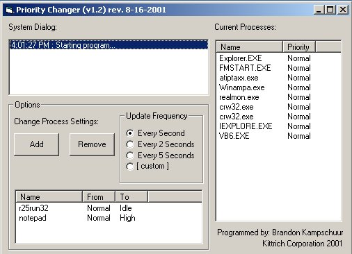

<div align="center">

## Process Priority Changer


</div>

### Description

This code is designed to change the priority of processes that are running on a windows machine. I had to write it for our company, which was having problems with Oracle processes taking over the server...this program was designed to change these processes to Low priority.
 
### More Info
 
You should be familiar with using the Win32 API functions to understand how the code works. Also, knowing about the listview and timer controls will help.


<span>             |<span>
---                |---
**Submitted On**   |2001-08-16 16:01:38
**By**             |[Brandon Kampschuur](https://github.com/Planet-Source-Code/PSCIndex/blob/master/ByAuthor/brandon-kampschuur.md)
**Level**          |Intermediate
**User Rating**    |5.0 (35 globes from 7 users)
**Compatibility**  |VB 6\.0
**Category**       |[Windows System Services](https://github.com/Planet-Source-Code/PSCIndex/blob/master/ByCategory/windows-system-services__1-35.md)
**World**          |[Visual Basic](https://github.com/Planet-Source-Code/PSCIndex/blob/master/ByWorld/visual-basic.md)
**Archive File**   |[Process Pr247858162001\.zip](https://github.com/Planet-Source-Code/brandon-kampschuur-process-priority-changer__1-26281/archive/master.zip)

### API Declarations

```
These are the API functions used:
Public Declare Function SetPriorityClass Lib "kernel32" (ByVal hProcess As Long, ByVal dwPriorityClass As Long) As Long
Public Declare Function GetPriorityClass Lib "kernel32" (ByVal hProcess As Long) As Long
Public Declare Function GetCurrentProcess Lib "kernel32" () As Long
Public Declare Function CloseHandle Lib "Kernel32.dll" (ByVal Handle As Long) As Long
Public Declare Function OpenProcess Lib "Kernel32.dll" (ByVal dwDesiredAccessas As Long, ByVal bInheritHandle As Long, ByVal dwProcId As Long) As Long
Public Declare Function EnumProcesses Lib "psapi.dll" (ByRef lpidProcess As Long, ByVal cb As Long, ByRef cbNeeded As Long) As Long
Public Declare Function GetModuleFileNameExA Lib "psapi.dll" (ByVal hProcess As Long, ByVal hModule As Long, ByVal ModuleName As String, ByVal nSize As Long) As Long
Public Declare Function EnumProcessModules Lib "psapi.dll" (ByVal hProcess As Long, ByRef lphModule As Long, ByVal cb As Long, ByRef cbNeeded As Long) As Long
Public Declare Function GetLastError Lib "kernel32" () As Long
```


